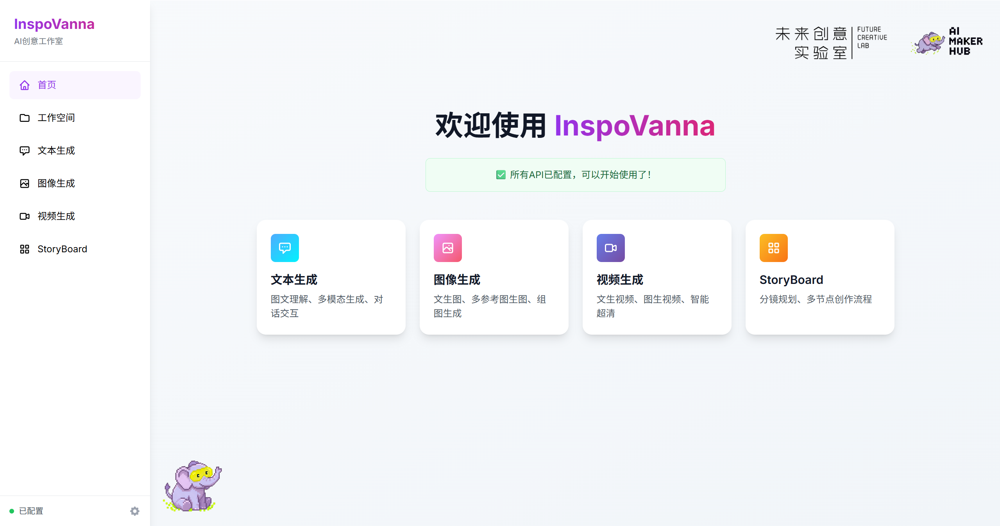
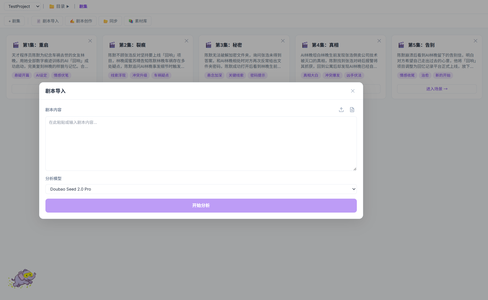
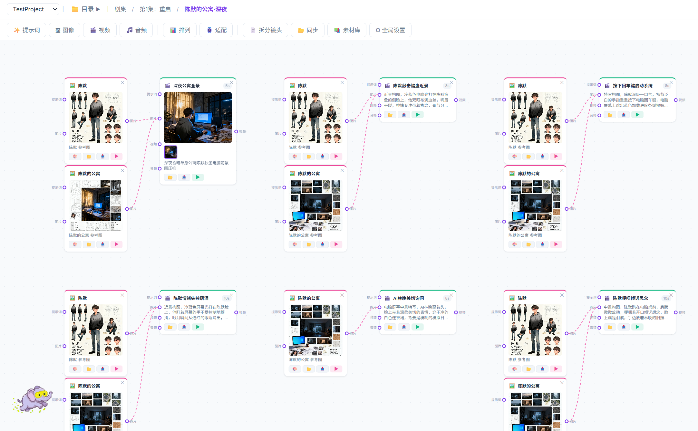

<div align="center">
  
</div>

**本地 AI 创意工作室** — 基于火山引擎 ARK API，集文本对话、图像生成、视频创作与一站式短剧创作于一体，所有生成内容自动保存在本地。

<div align="center">
  
  
</div>

欢迎加入 **AI Maker Hub** 社区！AI Maker Hub 社区是由未来创意实验室发起的 AIGC 创意者交流社区。

---

## ✨ Spotlight

**StoryBoard — 一站式短剧创作平台**

从剧本到成片的全流程 AI 辅助创作工具：

- **剧本创作**：与 AI 编剧助手对话式打磨故事点子，一键生成结构完整的剧本
- **智能拆分**：导入剧本后自动拆分为剧集 → 场景 → 镜头三级结构
- **分镜画布**：基于 Vue Flow 的可视化节点画布，支持文本、图像、视频、音频四种节点类型
- **素材生成**：每个镜头节点可直接生成图片、视频素材，支持 @mention 引用角色/道具/场景
- **角色库**：管理角色、道具、场景设定，一键生成设定图

<div align="center">
  
  
</div>

---

## 🚀 快速开始

**环境要求：** Python 3.8+

### Windows

双击 `run.bat`（或桌面快捷方式），首次运行会自动配置 Python 环境和依赖，完成后浏览器打开 `http://localhost:8765`。

### macOS / Linux

```bash
chmod +x run.sh
./run.sh
```

首次运行会自动检测 Python 环境，若未安装则：
- **macOS**：通过 Homebrew 自动安装（需已安装 [Homebrew](https://brew.sh)），否则提示手动安装
- **Linux**：提示执行 `sudo apt install python3 python3-venv python3-pip`

环境就绪后自动创建虚拟环境、安装依赖并启动服务。浏览器打开 `http://localhost:8765`。

### 配置密钥

首次使用需在 **设置** 页面配置以下密钥（也可直接编辑根目录 `config.json`）：

| 密钥 | 用途 | 获取方式 |
|------|------|----------|
| 火山方舟 API Key | 文本/图像/视频生成 | [火山方舟控制台](https://console.volcengine.com/ark) 创建接入点 |
| TOS AK / SK | 文件上传（参考图/视频等） | [火山引擎 TOS 控制台](https://console.volcengine.com/tos) |
| AI MediaKit API | 视频智能超清 | [智能媒体服务控制台](https://console.volcengine.com/ai-mediakit) |

### 工作空间

在设置页面指定一个本地文件夹作为工作空间，所有生成内容会按项目分类保存。每个项目下自动创建 `Text`、`Image`、`Video`、`Audio` 四个子文件夹。

---

## 📦 功能模块

### 💬 一、文本生成

多模态对话，支持上传图片、视频、文档进行交互。

**支持的模型：**
- Doubao Seed 2.0 Pro（默认）
- Doubao Seed 2.0 Lite

**基本操作：**
1. 点击左侧「+」新建对话
2. 在输入框输入消息，按 `Enter` 发送，`Shift+Enter` 换行
3. 点击输入框左侧附件按钮上传文件

**支持的文件类型：**
- 图片：JPG、PNG、WEBP
- 视频：MP4
- 文档：PDF、DOC、DOCX、PPT、PPTX、XLS、XLSX、TXT、MD、JSON、CSV 等

**其他功能：**
- 点击 AI 回复右上角图标可复制或保存到工作空间
- 鼠标悬停消息可见操作按钮

---

### 🎨 二、图像生成

根据文字描述和参考图片生成图像，自动识别三种模式：

| 参考图数量 | 模式 |
|------------|------|
| 0 张 | 文生图 |
| 1 张 | 图文生图 |
| 2-14 张 | 多图融合 |

**支持的模型与尺寸：**

| 模型 | 可用尺寸级别 |
|------|-------------|
| Seedream 4.0 | 1K、2K、4K |
| Seedream 4.5 | 2K、4K |
| Seedream 5.0 Lite | 2K、4K |

每个尺寸级别下支持多种比例（1:1、3:4、4:3、16:9、9:16、2:3、3:2、21:9）。

**参数说明：**
- **生成数量**：1-4 张
- **生成模式**：单张 / 组图（自动批量）
- **联网搜索**：仅 Seedream 5.0 Lite 支持，模型自主判断是否搜索互联网内容

**操作步骤：**
1. 输入提示词描述想要的图像
2. 可选：上传参考图片或从工作空间选择
3. 选择模型、尺寸、数量
4. 点击「生成图像」

**提示词技巧：**
- 用简洁连贯的自然语言描述：主体 + 行为 + 环境
- 可补充风格、色彩、光影、构图等美学元素
- 中文提示词不超过 300 个汉字，英文不超过 600 个单词

---

### 🎬 三、视频生成

#### 🎥 3.1 生成视频

根据文字描述生成视频，支持参考图片、参考视频和参考音频。

**支持的模型：**
- Seedance 2.0
- Seedance 2.0 Fast

**参数说明：**

| 参数 | 选项 |
|------|------|
| 分辨率 | 480p、720p、1080p |
| 画面比例 | 21:9、16:9、4:3、1:1、3:4、9:16 |
| 视频时长 | 4-15 秒 |
| 音频生成 | 默认开启，上传参考音频时自动锁定开启 |

**参考素材：**
- **参考图片**：最多 9 张，开启「首尾帧」模式后支持指定首帧/尾帧（1-2 张）
- **参考视频**：最多 3 个
- **参考音频**：1 个，支持本地上传或从工作空间 Audio 文件夹选择
- **联网搜索**：仅 Seedance 2.0 支持

**后台运行：**
提交生成任务后可自由切换页面，底部状态栏显示任务进度，完成后自动保存到工作空间并弹出通知。

#### ✨ 3.2 智能超清

使用 AI MediaKit 对视频进行超分辨率增强。

**操作步骤：**
1. 选择视频（本地上传或从工作空间选择）
2. 设置参数：

| 参数 | 选项 |
|------|------|
| 工具版本 | 标准版、专业版 |
| 场景 | AIGC、通用、UGC短视频、短剧、老片修复 |
| 目标分辨率 | 720p、1080p、2K、4K |

3. 点击「开始超清」

**提示词技巧：**
- 图片参考：参考/提取/结合「图片n」中的主体/元素，生成画面并保持特征一致
- 视频参考：参考「视频n」的动作/运镜/特效，生成画面并保持细节一致
- 音色参考：「角色」说："台词"，音色参考「音频n」
- 增加元素：清晰描述元素特征 + 出现时机 + 出现位置
- 删除元素：点明删除元素，同时强调保留不变的元素

---

### 🎭 四、StoryBoard（一站式短剧创作平台）

分层次的创意规划工具，从剧本到分镜一站式管理，支持 AI 辅助创作与直接生成素材。

#### 层级结构

```
项目
└── 剧集（Episode）
    └── 场景（Scene）
        └── 分镜画布（Shot Canvas）
            └── 节点：提示词 / 图像 / 视频 / 音频
```

#### 基本操作

**导航：**
- 顶部面包屑显示当前层级，点击可返回上级
- 点击「目录」按钮展开树形导航，可快速跳转任意剧集/场景
- 卡片右下角「进入场景 →」或「进入分镜 →」向下钻取

**剧集 / 场景管理：**
- 点击工具栏「+ 剧集」或「+ 场景」新建
- 点击卡片编辑标题、摘要、备注、标签
- 悬停卡片右上角可删除

**分镜画布（Shot Canvas）：**
- 工具栏提供四种节点：✨ 提示词、🖼 图像、🎬 视频、🎵 音频
- 拖拽节点自由排布；连线表示素材引用关系（图像→视频等）
- 「排列」自动整理节点布局；「适配」缩放至全览
- 点击节点打开右侧属性面板，编辑提示词、参数、历史记录

#### 节点操作

| 节点类型 | 可设置参数 |
|----------|-----------|
| 提示词 | 文本内容 |
| 图像 | 模型、尺寸、数量、参考图来源 |
| 视频 | 模型、分辨率、时长、画面比例、参考素材 |
| 音频 | 时长、参考音频 |

每个节点均支持：
- **✨ AI 生成**：直接在节点上触发生成，结果自动保存到工作空间
- **📂 工作空间选取**：从已有文件中关联素材
- **📤 本地上传**：上传本地文件作为参考
- **历史记录**：查看该节点的所有历史生成结果

#### 剧本导入

点击工具栏「📄 剧本导入」，粘贴或上传剧本文本，AI 自动拆分为：
- **剧集**：按故事段落分集
- **场景**：按场景切换分段
- **镜头**：按动作/对话逐帧拆分，并推荐节点类型与提示词

#### 素材库

点击工具栏「📚 素材库」管理可复用的角色、道具、场景：
- 为每个条目编写描述、标签和画风
- 支持 AI 生成参考图或本地上传
- 在节点提示词中通过 `@mention` 引用，自动注入描述与参考图

#### AI 助手

点击右下角大象图标唤出 AI 助手：
- 优化提示词、分析剧本结构、设计分镜方案
- 助手感知当前所在层级（剧集/场景/分镜），回答更精准
- 支持多轮对话，保留最近 20 条上下文

#### 工作空间同步

点击工具栏「📂 同步」，自动在工作空间创建对应的文件夹结构：

```
<工作空间>/<项目>/Storyboard/
├── <剧集名>/
│   └── <场景名>/
└── storyboard.json    ← 完整项目数据
```

---

### 📁 五、工作空间

管理所有生成内容的文件系统。

**项目管理：**
- 新建项目：每个项目包含 Text、Image、Video、Audio 四个文件夹
- 切换项目：点击左侧项目列表
- 删除项目：点击项目右上角删除按钮

**文件操作：**
- 浏览：点击文件夹进入，面包屑导航返回上级
- 新建文件夹：右上角图标按钮
- 上传：点击上传按钮或拖拽文件到页面
- 重命名：点击文件/文件夹名称
- 删除：悬停可见删除按钮
- 移动：拖拽文件到目标文件夹，也可拖到面包屑导航移出文件夹
- 预览：点击图片/视频文件可预览
- 提取帧：点击视频文件可提取首帧/尾帧图片

---


## ❓ 常见问题

**Q: 页面显示"未配置"？**
A: 进入设置页面检查 API Key 是否已填写。

**Q: 视频生成失败？**
A: 确认已配置 ARK API Key，且在火山方舟控制台已创建对应模型的接入点。

**Q: 参考图片上传失败？**
A: 检查 TOS AK/SK 是否正确配置，TOS Bucket 是否已创建。

**Q: StoryBoard 界面加载失败？**
A: StoryBoard 依赖 esm.sh 和 jsdelivr.net CDN，请确认网络可访问这两个域名。

**Q: 端口被占用？**
A: Windows 下在任务管理器中结束占用 8765 端口的进程；macOS/Linux 下执行 `lsof -i :8765` 查找并 `kill` 对应进程，或修改 `server.py` 中的端口号。

**Q: 如何更新模型？**
A: 在 `config.json` 的 `models` 字段中添加或修改模型名称和接入点 ID。

---

## 🛠 技术栈

- **后端**：Python 标准库 `http.server`，单文件，无框架
- **前端**：原生 JavaScript + Tailwind CSS（CDN）
- **StoryBoard**：Vue 3 + Vue Flow（均通过 esm.sh CDN 加载）
- **依赖**：`tos`（火山引擎对象存储）、`opencv-python`（帧提取）、`Pillow`（图标生成）

## 🔒 安全说明

- `config.json` 包含 API 密钥，已加入 `.gitignore`，请勿提交
- 所有数据仅存储在本地工作空间，不会上传到第三方服务器
- API 密钥仅在运行时加载到内存中

## 📄 许可证

MIT
